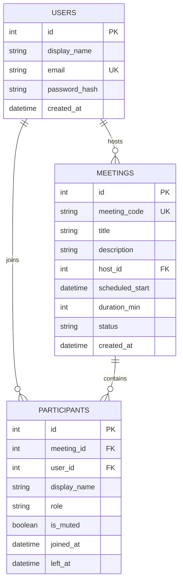

# Zoom Clone

A Zoom-inspired meeting application with account authentication, instant meetings, scheduled meetings, invite-link joining, participant presence, recent meetings, and browser camera/microphone controls.

## Tech Stack

- **Frontend:** Next.js 16, React 19, TypeScript, Tailwind CSS, Lucide icons
- **Backend:** FastAPI, Uvicorn, SQLAlchemy, Pydantic
- **Database:** SQLite by default, configurable with `DATABASE_URL`
- **Authentication:** Email/password authentication with bearer tokens

## Project Structure

```text
backend/    FastAPI API, SQLAlchemy models, seed script
frontend/   Next.js application
```

## Setup

### Backend

From the repository root:

```powershell
cd backend
python -m venv .venv
.\.venv\Scripts\Activate.ps1
pip install -r requirements.txt
```

On macOS/Linux, activate the environment with:

```bash
source .venv/bin/activate
```

Seed the local SQLite database:

```bash
python seed.py
```

The seed account is:

```text
Email:    arvind@example.com
Password: password123
```

Start the API:

```bash
uvicorn main:app --reload --host 127.0.0.1 --port 8005
```

The API is available at [http://localhost:8005](http://localhost:8005), with interactive documentation at [http://localhost:8005/docs](http://localhost:8005/docs).

The default database is `backend/zoom_clone.db`. Set `DATABASE_URL` before starting the backend to use another database, for example:

```powershell
$env:DATABASE_URL = "sqlite:///zoom_clone.db"
```

### Frontend

In a second terminal:

```powershell
cd frontend
npm install
npm run dev
```

Open [http://localhost:3000](http://localhost:3000).

The frontend uses `http://localhost:8005` by default. To point it at another API, create `frontend/.env.local`:

```env
NEXT_PUBLIC_API_URL=http://localhost:8005
```

## API

All protected endpoints use the header `Authorization: Bearer <token>` returned by login or signup.

| Method | Endpoint | Auth | Purpose |
| --- | --- | --- | --- |
| `GET` | `/health` | No | Health check |
| `POST` | `/auth/signup` | No | Create an account |
| `POST` | `/auth/login` | No | Authenticate an account |
| `GET` | `/auth/me?user_id={id}` | No | Get a user response by ID |
| `POST` | `/meetings/instant` | Yes | Create an instant meeting |
| `POST` | `/meetings/schedule` | Yes | Schedule a meeting |
| `GET` | `/meetings/upcoming` | Yes | List the signed-in user’s upcoming hosted meetings |
| `GET` | `/meetings/recent` | Yes | List completed meetings hosted by or attended by the signed-in user |
| `GET` | `/meetings/{code}` | No | Get meeting details by invite code |
| `POST` | `/meetings/{code}/join` | No | Join through an invite link or meeting code |
| `POST` | `/meetings/{code}/leave?display_name={name}` | No | Leave a meeting |
| `GET` | `/meetings/{code}/participants` | No | List active participants |

Only authenticated users can create or schedule meetings. Anyone with a valid meeting link can join by entering a display name.

## Database Schema



## Deployed Links

No public deployment is configured in this repository.

Local links:

- Frontend: [http://localhost:3000](http://localhost:3000)
- Backend: [http://localhost:8005](http://localhost:8005)
- API docs: [http://localhost:8005/docs](http://localhost:8005/docs)

## Assumptions and Limitations

- This project does not implement real peer-to-peer or server-side video streaming. The meeting room uses the browser’s local `getUserMedia` stream for camera and microphone preview.
- Participant presence is refreshed through HTTP polling rather than WebSockets.
- Meeting creation and scheduling require authentication; invite-link joining does not.
- The default token format is a lightweight development token, not a production JWT/session system.
- SQLite is suitable for local development. Production deployments should use a managed database, secure secret management, migrations, and stronger authentication.
- Meeting times are treated as local wall-clock values so the selected browser time is preserved for the application’s IST workflow.